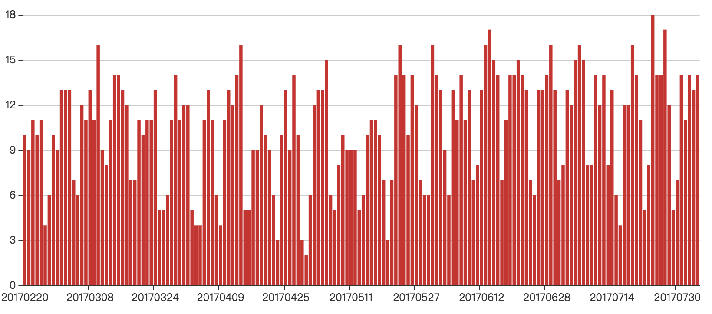

# 极客邦公众号数据采集和统计
最近极客邦发布了一款新产品—[极客搜索](http://s.geekbang.org/)，整合了极客邦下面的技术文章资源。抱着尝鲜的态度，我也去试用了一下，发现搜索的速度特别快。分析了一下为什么这么快，主要有两点吧：  
1、资源太少了!!!，12个公众号加起来才5161篇文章；  
2、用了Vue框架，异步加载数据。这款产品还是很好用的，推荐一下，也希望快点增加可搜索的技术资源。     
  
最近正想采集一些文章来做分词，该界面是用Vue写的，那么所有的数据都是走的接口吧，这样数据采集就极为方便了，因此心血来潮，趁着产品刚刚推出来，反爬机制应该不强，就采集了极客邦所有的公众号数据。

## 文章采集
主要分为两步，采集文章链接和原文采集。   
1、采集采集文章链接，通过搜索接口，抓取到所有的文章链接

从返回的数据中，可以抓取到文章原文的链接，接下来就是通过链接采集原文的数据了。

2、原文信息采集   
使用scrapy框架来采集微信文章的数据，总共采集了5151篇文章。

## 数据分析  
接下来对采集的文章做了一些简单的统计。

### 哪个公众号写了最多的文章
infoQ写了最多的文章，998篇，占了19.35%。StuQ排第二，835篇，占比16.19%，EGONetworks排第三，802篇，占比15。55%。这三个部分刚好是极客邦科技的三大业务。  

### 每天发布的文章总数
随着运营的公众号越来越多，文章的数量在不断的上涨，2017每个月都能达到250篇以上。编辑的能力很强悍。   

每天统计发布的文章数量：很有规律，周一到周五发的比较多，周六日发的比较少。辛苦在周六周日加班的人。   

### 文章词频统计
对所有文章进行分词，然后统计出词频。   
前10:我们、一个、数据、技术、可以、服务、使用、需要、问题、系统   

前10个词串起来就是：我们需要使用一个系统来服务技术或数据的问题。是否在暗示着什么，我能不能开发一个给你们用啊，商机就在这里呀。由于对分词结果没有做调整，所有出现了很多的常用修饰词等。这是一个耗体力活，以后再干。

### 作者统计
根据文章的作者进行统计。前10:StuQ、EGO、InfoQ、徐川、大咖说、陈园园、Q新闻、靛青K&郭亮、斯达克学院、大牛V课堂。

### 文章标题的趋势
文章标题的命名也反映了一段时间的趋势，因此我将所有文章的标题抽取出来，做了一个分词，通过自定义jieba的字典和剔除很多的修饰词等，得到下面的结果。
2015：技术排第一位，这也符合极客邦的特点吧。微直播和微课堂提到很多，主要是StuQ这个公众号广告打的太多了。当然也能够看到互联网金融、大数据、创业、容器技术等当年很火的一些词。

2016：技术仍然排第一位，出现了一些云计算，开源等词，同时也有很多国内的大公司阿里，AWS，百度，京东等

2017：万变不离技术，同时机器学习、深度学习、人工智能、AI等词的使用量增多，符合现在的各种学习热。

从文章标题的命名来看，极客邦的微信公众号内容基本上是跟随最新的技术趋势。掌握科技发展趋势，分析一下标题就行了。

## 总结
本文主要的工作就是数据的采集和分析，对于数据采集方面，难度并不大，使用scrapy很快就可以搞定。而数据分析则比较消耗时间，我也只做了一些简单的统计。

